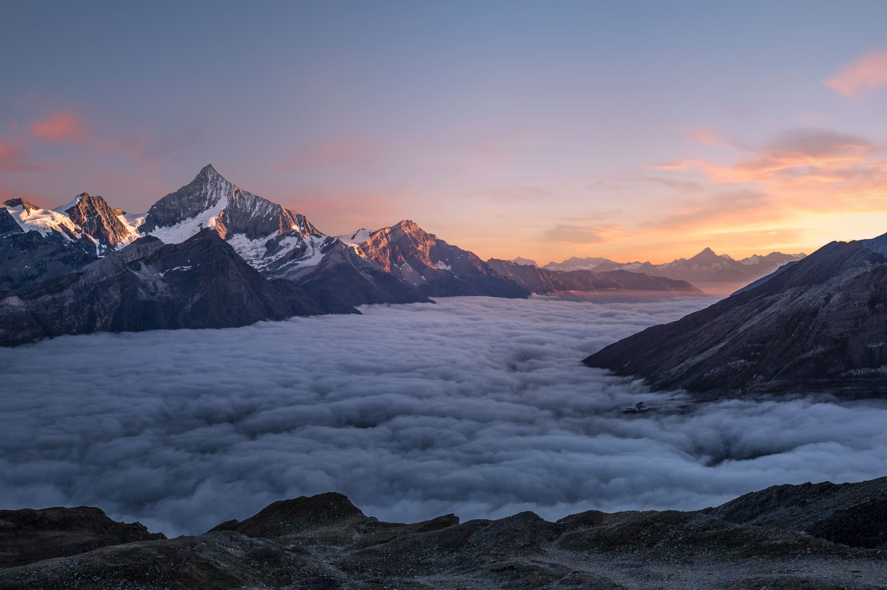

# PeakFinder - Explore the Himalayan Giants



## 🌟 Overview

PeakFinder is an interactive web application that showcases the majestic peaks of the Himalayas. It provides detailed information about famous mountains, their locations, climbing history, and helps users plan their next great adventure. The website features stunning imagery, interactive maps, and comprehensive details about each peak.

## 🏔️ Features

### Interactive Peak Explorer
- **Dynamic Peak Cards**: Browse through famous Himalayan peaks with automatic image slideshows
- **Filter by Region**: Filter peaks by country (Nepal, Pakistan, India)
- **Detailed Information**: Each peak includes elevation, location, first ascent date, difficulty level, and best climbing season
- **Interactive Modal**: Click on any peak to view comprehensive details and image galleries

### Visual Experience
- **Hero Section**: Dynamic background transitions showcasing different mountain vistas
- **Interactive Map**: Visual representation of peak locations across the Himalayan range
- **Responsive Design**: Fully responsive layout that works on desktop, tablet, and mobile devices
- **Smooth Animations**: Elegant hover effects and transitions throughout the interface

### Expedition Planning
- **Step-by-Step Guide**: Four-phase expedition planning process
- **Contact Form**: Direct communication channel for expedition inquiries
- **Statistics Section**: Key facts about Himalayan climbing achievements

## 🛠️ Technologies Used

- **HTML5**: Semantic markup with accessibility features
- **CSS3**: Modern styling with CSS Grid, Flexbox, and custom properties
- **JavaScript (ES6+)**: Interactive functionality and dynamic content
- **Font Awesome**: Icon library for UI elements
- **Google Fonts**: Typography (Playfair Display & Roboto)

## 📁 Project Structure

```
PeakFinder_final/
├── index.html          # Main HTML file
├── style.css           # Stylesheet with responsive design
├── script.js           # JavaScript functionality
├── images/             # Image assets
│   ├── AHome.png       # Hero background
│   ├── everest1.jpg    # Mount Everest images
│   ├── K2_1.jpg        # K2 images
│   ├── kangchenjunga1.jpg # Kangchenjunga images
│   ├── kamet1.jpg      # Kamet images
│   ├── Lhotse1.jpg     # Lhotse images
│   ├── nanda-devi1.jpg # Nanda Devi images
│   └── walkers.jpg     # Trekking image
└── README.md           # This file
```

## 🚀 Getting Started

### Prerequisites
- A modern web browser (Chrome, Firefox, Safari, Edge)
- No additional software installation required

### Installation
1. Clone or download the project files
2. Open `index.html` in your web browser
3. The website will load immediately with all features functional

### Local Development
For development purposes, you can use any local server:

```bash
# Using Python 3
python -m http.server 8000

# Using Node.js (if you have http-server installed)
npx http-server

# Using PHP
php -S localhost:8000
```

Then navigate to `http://localhost:8000` in your browser.

## 🎯 Key Features Explained

### Dynamic Background Transitions
The hero section automatically cycles through different mountain backgrounds every 4 seconds, creating an immersive experience.

### Peak Filtering System
Users can filter peaks by country using the filter buttons, making it easy to find peaks in specific regions.

### Interactive Map
A custom-built interactive map shows the geographical distribution of peaks across the Himalayan range with clickable markers.

### Responsive Navigation
Mobile-friendly hamburger menu that transforms into a full navigation on larger screens.

### Modal System
Detailed peak information is displayed in elegant modal windows with image galleries and comprehensive data.

## 🎨 Design Philosophy

The design emphasizes:
- **Accessibility**: ARIA labels and semantic HTML
- **Performance**: Optimized images and smooth animations
- **User Experience**: Intuitive navigation and clear information hierarchy
- **Visual Appeal**: Stunning mountain photography and elegant typography

## 📱 Browser Support

- Chrome (latest)
- Firefox (latest)
- Safari (latest)
- Edge (latest)
- Mobile browsers (iOS Safari, Chrome Mobile)

## 🤝 Contributing

This is a showcase project demonstrating modern web development techniques. Feel free to:
- Report bugs or issues
- Suggest new features
- Improve accessibility
- Enhance performance

## 📄 License

This project is created for educational and showcase purposes. All images are used for demonstration.

## 📞 Contact

For questions about this project:
- Email: hello@peakfinder.com
- Phone: +1 (123) 456-7890

---

**PeakFinder** - Your guide to the roof of the world. 🏔️
